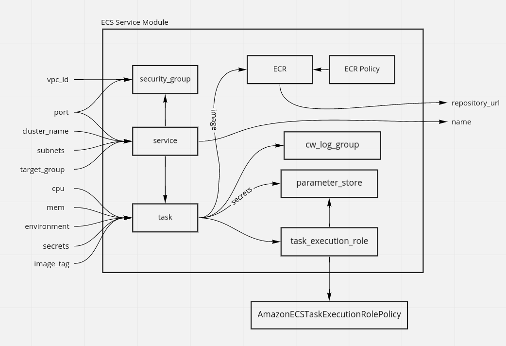

# ECS Service Module

This folder contains a [Terraform](https://terraform.io) module to deploy an AWS ECS Service on top of an ECS Cluster.



## How to use this module

This folder defines a [Terraform module](https://www.terraform.io/docs/modules/usage.html), which you can use in your code by adding a `module` configuration and setting its `source` parameter to URL of this folder.

```hcl
module "my_app" {
  # TODO: update this to the final URL
  # Check the last version on repository and change the ref parameter
  source = "github.com/diego-alves/terraform-aws-container-service//modules/ecs?ref=v0.1.0"

  # ECS Cluster Name
  cluster_name = "mycluster"
 
  # ECS Service Name
  name = "myapp"

  # List of Subnets to include in the ECS Service
  subnets = ["subnet-abcdef123456", subnet-abcdef9851541]

  # Load Balancer Target Group
  target_group = "arn:aws:elasticloadbalancing:us-east-1:123456789:targetgroup/my-targetgroup/abcdef123456"

  # VPC ID
  vpc_id = "vpc-abcdef012345"

}
```

